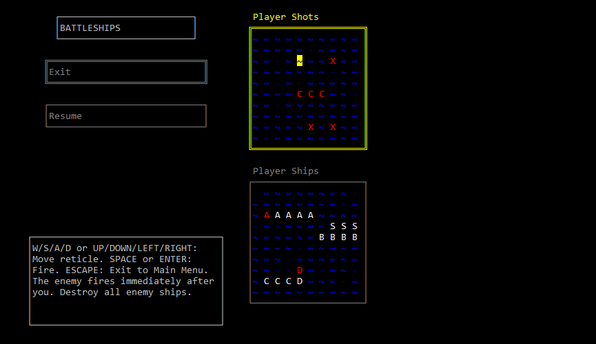

# Battleship

Simple Battleships game. (Windows console application)

Written in C++ using Visual Studio.

## Installation (Windows 64-bit)

1. [Download Battleship.zip](https://github.com/Cresspresso/Battleship/releases/download/1.0/Battleship.zip)
2. Unzip (e.g. by using [7-Zip](https://www.7-zip.org/download.html))
3. Run Battleship_x64.exe

## Rules

### Keyboard Controls
Key(s)								|	Description
--- | ---
W/S or UP/DOWN						|	Navigate menu buttons.
ENTER or SPACE						|	Confirm or Select.
ESCAPE								|	Navigate back to main menu, or previous view.
W/S/A/D or UP/DOWN/LEFT/RIGHT		|	Move ship or cursor. (When a board is focused.)
Q/E									|	Select a different ship for placement (When the placement board is focused.)
SPACE								|	Rotate the ship. (When the placement board is focused.)

### Goal
The aim of the game is to destroy the enemy's ships before they
destroy yours.

### Setup
You can place your ships manually or randomly.
Ships must not overlap, and you cannot confirm your placement
until every ship is valid.

### Gameplay
Move your cursor around with the arrow keys and press SPACE to fire.
If a cell is bright red, it means a ship has been hit.

### Board Cells
Symbol		|	Meaning
--- | ---
~			|	Unknown cell that has not been fired at, OR Empty ocean cell.
`-`			|	Empty ocean cell, which has been fired at.
X			|	An unknown ship has been hit in that cell.

### Ships
Symbol		|	Name				|	Length
--- | --- | ---
A			|	Aircraft Carrier	|	5
B			|	Battleship			|	4
C			|	Cruiser				|	3
S			|	Submarine			|	3
D			|	Destroyer			|	2

### Outcome
If you destroy all 5 enemy ships, you win. If the enemy destroys
all your ships, you lose.

Debug Mode can be enabled from the Main Menu.
If Debug Mode is enabled (as shown by the green X in the checkbox),
both the player's boards and the enemy's boards will be visible
during gameplay.

---

. | .
--- | ---
Version | 1.0
Author | Elijah Shadbolt
Date | 14/06/2018

Bachelor of Software Engineering

Media Design School

Auckland

New Zealand

(c) 2018 Media Design School
